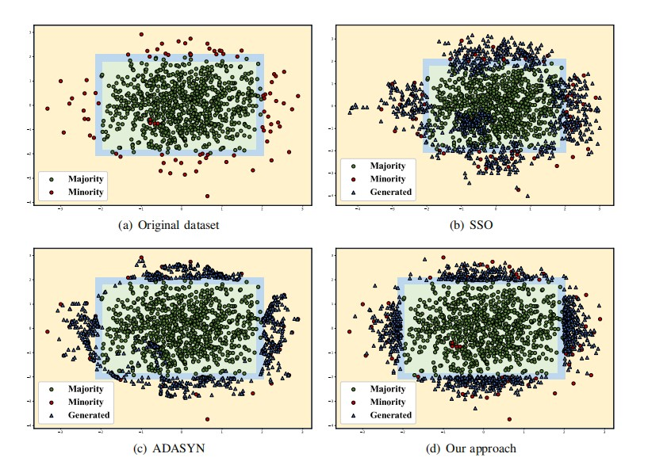

# Imbalance

1. 类不平衡+反事实+过采样
  - Name: <a href="http://arxiv.org/abs/2008.09488" target="_blank">
    Counterfactual-based minority oversampling for imbalanced classification </a>
   - 现有过采样方法更关注少数类信息，失去全局信息（边界/重叠的样本）；
   - 决策边界附近样本在分类时贡献更大；
   - 使用MAD（某个特征变量的中值绝对偏差）度量距离，生成的样本点更聚集在决策边界处；
   - “minimum inversion”：扰动满足截断正态分布，抽样使用吉布斯抽样
